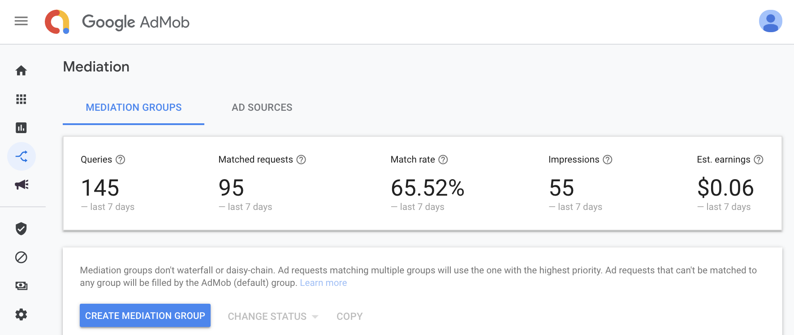
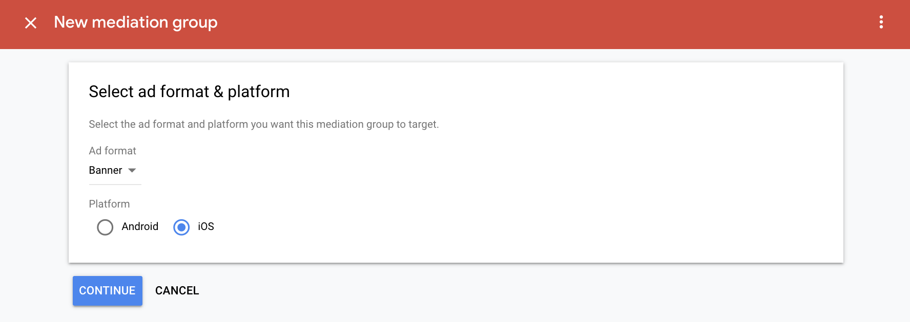
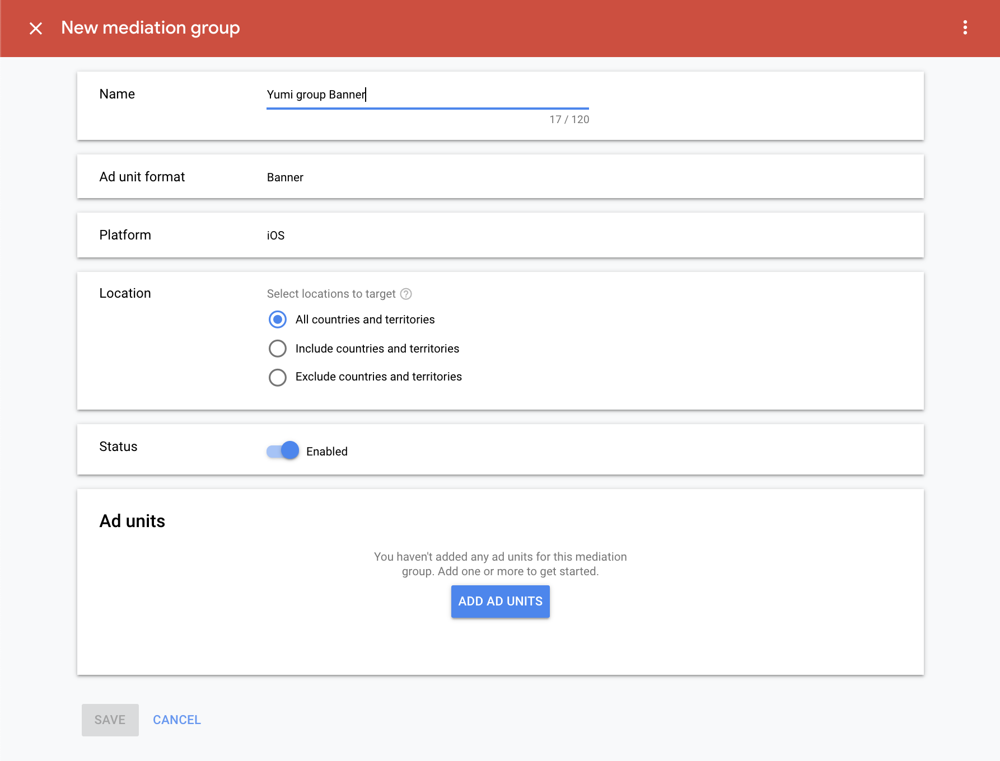
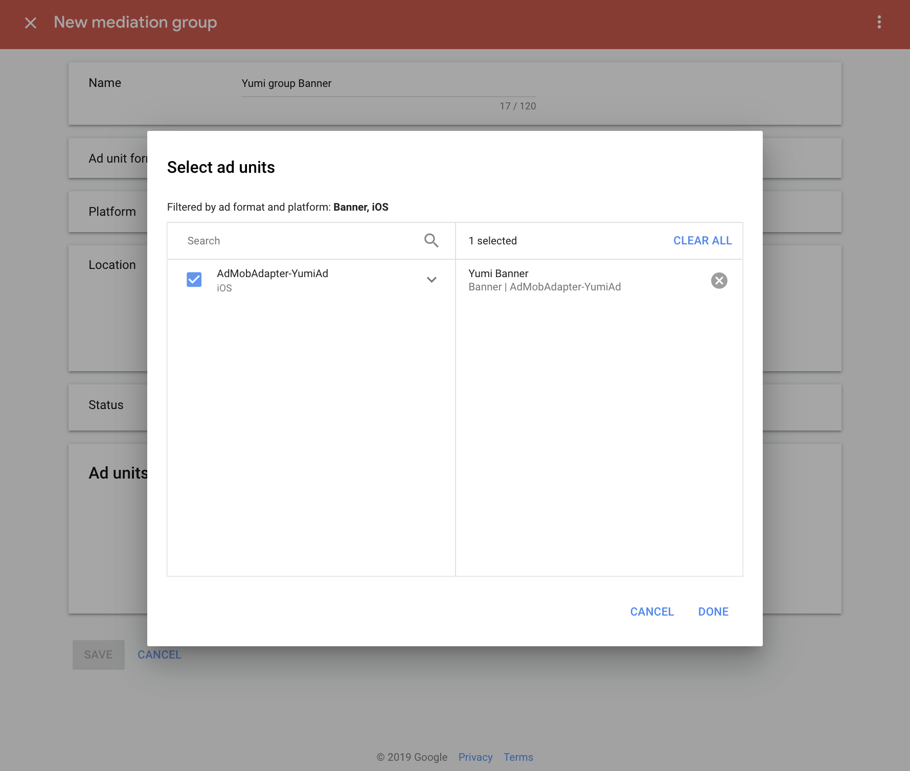
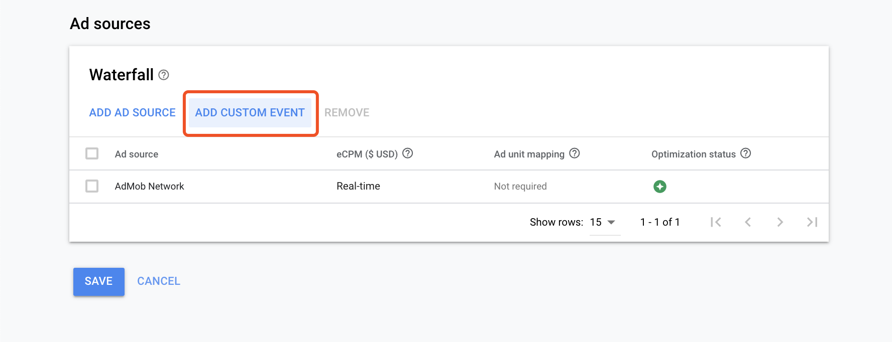
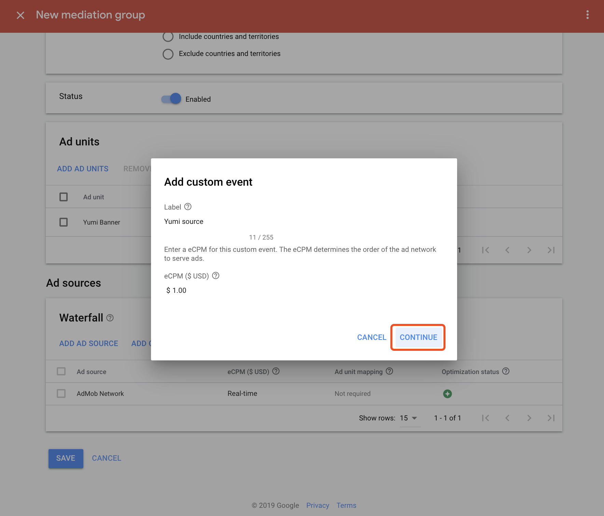
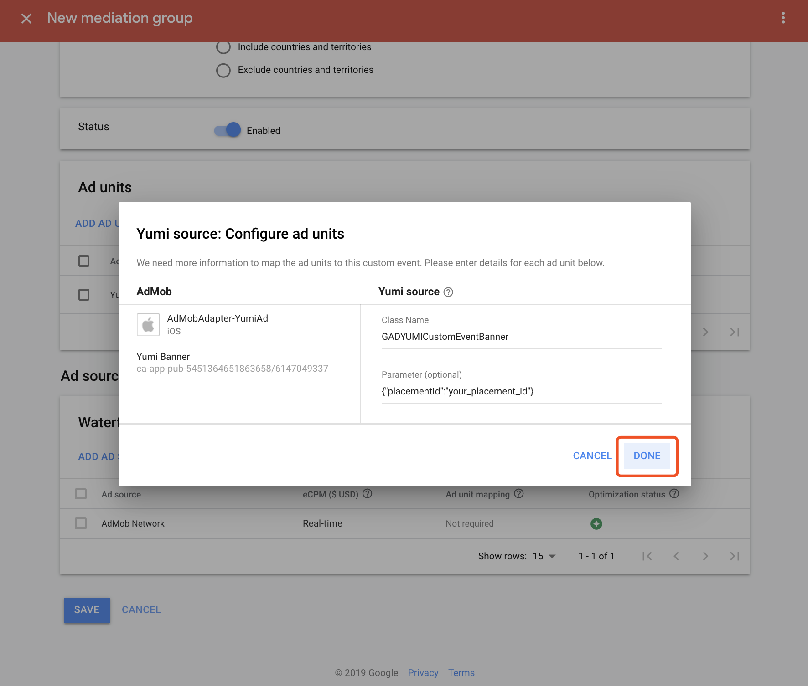
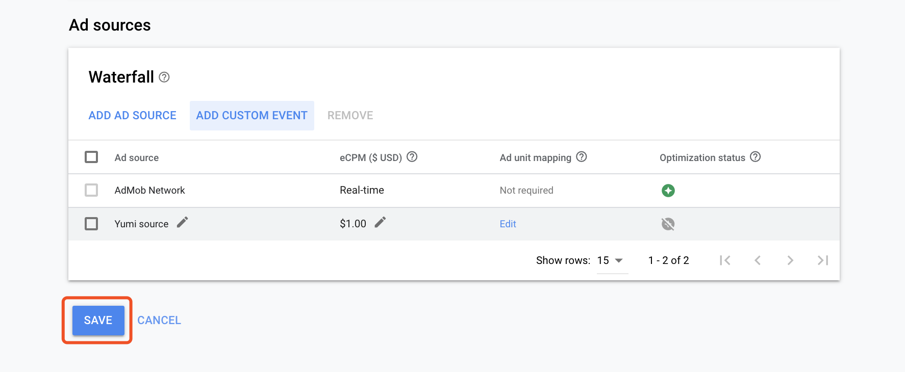

- [1 接入 YumiAd SDK 和 AdMob SDK](#1-接入-yumiad-sdk-和-admob-sdk)
    - [1.1 导入 YumiAd SDK 和 Admob SDK](#11-导入-yumiad-sdk-和-admob-sdk)
        - [CocoaPods （首选）](#cocoapods-首选)
        - [手动下载](#手动下载)
    - [1.3 添加 Yumi Adapters](#13-添加-yumi-adapters)
        - [1.3.1 Banner Adapter](#131-banner-adapter)
        - [1.3.1 Interstitial Adapter](#131-interstitial-adapter)
        - [1.3.1 Reward Video Adapter](#131-reward-video-adapter)
- [2 在 AdMob 平台 添加 YumiAd 广告源](#2-%e5%9c%a8-admob-%e5%b9%b3%e5%8f%b0%e6%b7%bb%e5%8a%a0-yumiad-%e5%b9%bf%e5%91%8a%e6%ba%90)
- [3 测试 ID](#3-测试-id)


## 1 接入 YumiAd SDK 和 AdMob SDK
### 1.1 导入 YumiAd SDK 和 Admob SDK
#### CocoaPods （首选）
要将该 SDK 导入 iOS 项目，最简便的方法就是使用 [CocoaPods](https://guides.cocoapods.org/using/getting-started)。请打开项目的 Podfile 并将下面这行代码添加到应用的目标中：
```ruby
 pod 'YumiAdSDK'
 pod 'Google-Mobile-Ads-SDK'
```
然后使用命令行运行：
```
pod install --repo-update
```

#### 手动下载

Admob SDK 手动接入 [参考文档](https://developers.google.com/admob/ios/quick-start) 。<br>
YumiAdSDK 手动接入 [参考文档](https://github.com/yumimobi/YumiAdSDKDemo-iOS/blob/master/normalDocuments/YumiAdSDK%20for%20iOS(zh-cn).md#%E6%8E%A5%E5%85%A5%E6%96%B9%E5%BC%8F)。

### 1.3 添加 Yumi Adapters
将以下文件添加到工程里面
#### 1.3.1 Banner Adapter
[GADYUMICustomEventBanner.h](https://github.com/yumimobi/AdMobAdapter-YumiAd-iOS/blob/master/AdMobAdapter-YumiAd-iOS/Banner/GADYUMICustomEventBanner.h)<br>
[GADYUMICustomEventBanner.m](https://github.com/yumimobi/AdMobAdapter-YumiAd-iOS/blob/master/AdMobAdapter-YumiAd-iOS/Banner/GADYUMICustomEventBanner.m)

#### 1.3.1 Interstitial Adapter
[GADYUMICustomEventInterstitial.h](https://github.com/yumimobi/AdMobAdapter-YumiAd-iOS/blob/master/AdMobAdapter-YumiAd-iOS/Interstitial/GADYUMICustomEventInterstitial.h)<br>
[GADYUMICustomEventInterstitial.m](https://github.com/yumimobi/AdMobAdapter-YumiAd-iOS/blob/master/AdMobAdapter-YumiAd-iOS/Interstitial/GADYUMICustomEventInterstitial.m)

#### 1.3.1 Reward Video Adapter
[GADYUMICustomEventRewardVideo.h](https://github.com/yumimobi/AdMobAdapter-YumiAd-iOS/blob/master/AdMobAdapter-YumiAd-iOS/Reward%20Video/GADYUMICustomEventRewardVideo.h)<br>
[GADYUMICustomEventRewardVideo.m](https://github.com/yumimobi/AdMobAdapter-YumiAd-iOS/blob/master/AdMobAdapter-YumiAd-iOS/Reward%20Video/GADYUMICustomEventRewardVideo.m)


## 2  在 [AdMob 平台](https://apps.admob.com/v2/home)添加 YumiAd 广告源
以下示例是在已有应用（AdmobAdapter-YumiAd），已有广告位（Yumi Banner）上配置 Yumi source。仅供参考，如果实际情况与此不符，请酌情处理。

1. 目录中选择 "[Mediation](https://apps.admob.com/v2/mediation/groups/list)"，选择 "CREATE MEDIATION GROUP"



2. 选择您要使用的广告形式及操作系统，YumiAd 目前支持 Banner, Interstitial 及 Rewarded Video，此处以 Banner 为例，点击 "CONTINUE" 进入下一步



3. 输入 Name，其它设置保持默认，或参考下图设置。点击 "ADD AD UNIT" 选择要添加的广告位



4. 在广告位选择框中，选择广告位，点击 "DONE" 保存



5. 点击 "ADD CUSTOM EVENT" 添加自定义广告源



6. 输入第三方广告源名称，此处以 Yumi source 为例，可根据需求进行自定义，根据需要对第三方广告源进行价格设置



7. 对 YumiAd 广告源进行配置。在 Class Name 中填写完整的适配器类名，以 demo 中适配器类名为例，

Banner 为 `GADYUMICustomEventBanner`

激励视频为 `GADYUMICustomEventRewardVideo`

插屏为 `GADYUMICustomEventInterstitial`

Parameter 中需填写您在 YumiAd 申请的 slotId，点击 "DONE" 完成 YumiAd 的配置
```json
{"placementId" : "your_placement_id"}
```

测试阶段可以将 **your_placement_id** 替换成 **测试 key**，上线时再改成正式 key。



8. Ad source 列表中可以看到所设置的广告源 YumiAd，点击 "SAVE" 完成 Mediation 的配置



## 3 测试 ID

您在测试中可使用如下 ID 进行测试，测试ID不会产生收益，应用上线时请使用正式 ID。

| 广告形式 | Test Placement ID |
| :------: | :--------- |
|  Banner  | l6ibkpae   |
| 插屏广告 | onkkeg5i   |
| 激励视频 | 5xmpgti4   |